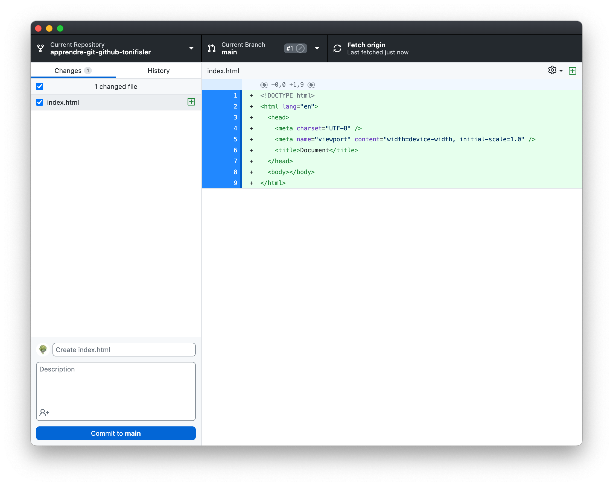
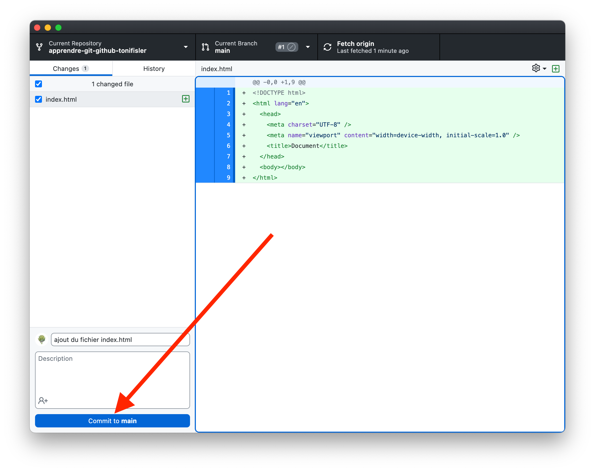
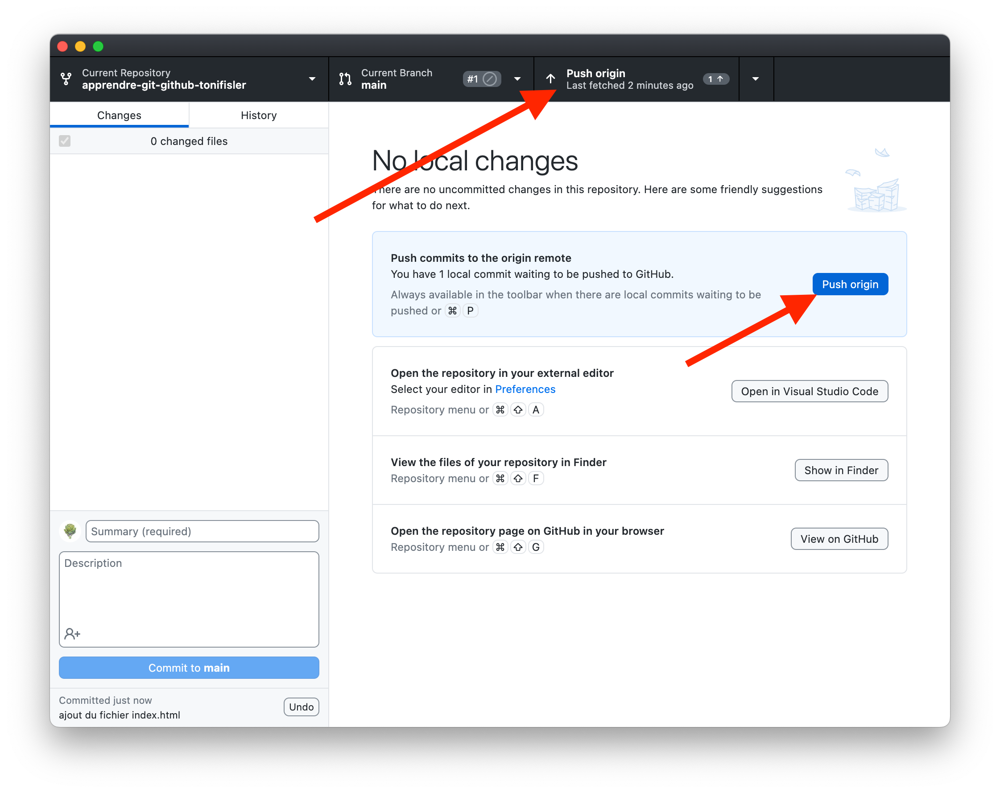
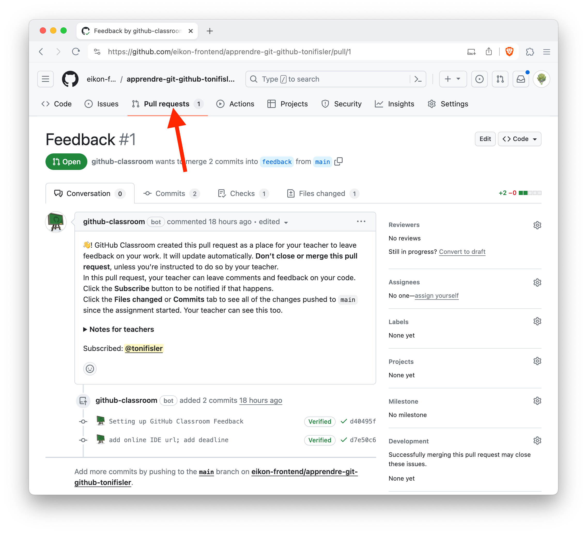

# Introduction à Git

## Faites vos modifications

1. Ajoutez un fichier `index.html` à la racine de votre répertoire de travail.
1. Générez le squelette de votre fichier html avec l'extension **!** de **Emmet**.
1. Paramétrez la balise `lang` en "fr"
1. Ajoutez le titre "Apprendre Git" dans la balise `<title>`.
1. Ajoutez une image dans le `<body>` (il faudra également ajouter l'image dans votre répertoire de travail).
1. Ajoutez un paragraphe de texte et tout le reste qui vous semble nécessaire.
1. Ajoutez un fichier `style.css` à la racine de votre répertoire de travail.
1. Ajoutez une règle de style pour le titre de votre page.

## Contrôlez vos changements

En allant dans Github Desktop, vous devriez voir les fichiers que vous avez ajoutés et/ou modifiés. Vous pouvez voir les différences entre les fichiers et les valider.

## Créez le commit (sauvegarde)

Entrez un message de commit et cliquez sur "Commit to main".

## Publiez vos modifications

Cliquez sur "Push origin" pour publier vos modifications sur Github.

## Consultez votre Pull Request

Allez sur votre dépôt Github et cliquez sur "Pull Requests" pour voir votre Pull Request. Des tests vont être lancés pour vérifier que votre code est correct! Refaites le même processus plusieurs fois pour vous entraîner ou corriger vos erreurs!

